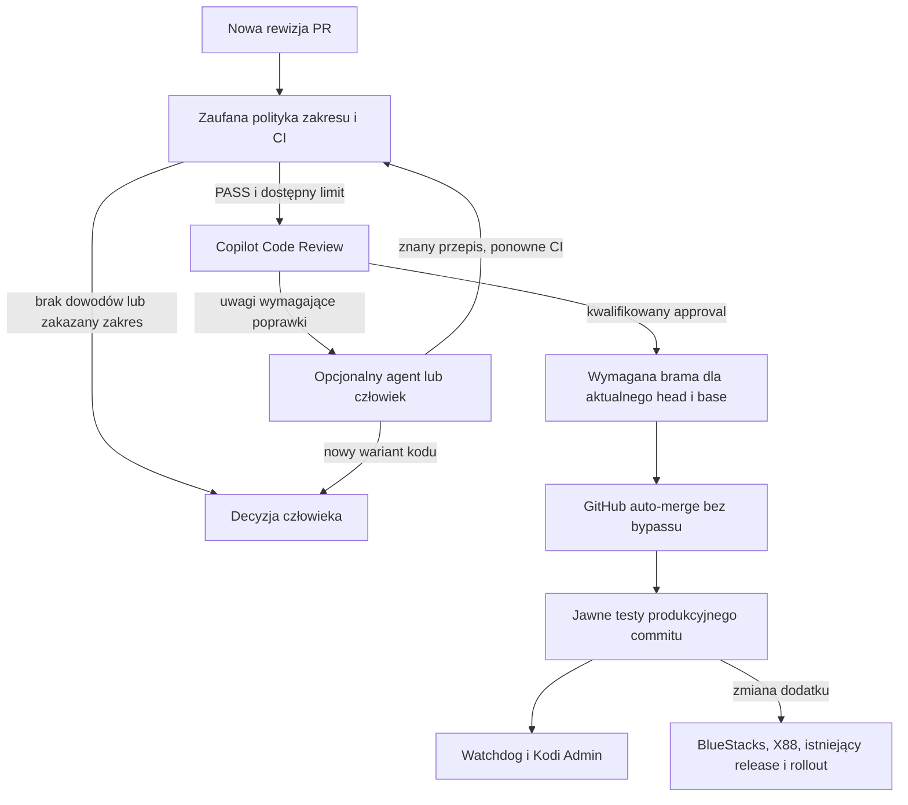

# Copilot w kontrolowanej automatyzacji PR — docelowy plan implementacji

Data: 8 września 2026. Status: **PO NIEZALEŻNYM REVIEW; IMPLEMENTACJA**.

Użytkownik zlecił niezależne review, implementację, wdrożenie i testy.
Preflight CDP potwierdził aktywny Copilot Pro (0/1500 kredytów AI w chwili odczytu),
budżet płatnych nadwyżek AI $0 ze stop usage oraz wyłączone approvals w repo.
Funkcja approvals jest widoczna, ale jej działanie nie jest jeszcze zakwalifikowane.
Nie włączono płatnych nadwyżek ani automatycznego scalania. Dokument nie jest zgodą na zakup
abonamentu, obejście wymaganych reviews ani wdrożenie własnej polityki przez bota.

## 1. Cel i najważniejsza decyzja

Włączyć Copilota do oceny poprawności i bezpieczeństwa zmian oraz przygotowywania
poprawek. Zachować deterministyczne testy, skanowanie, kwalifikację zakresu zmiany
i natywne zabezpieczenia GitHub jako warunki scalenia.

Docelowy podział odpowiedzialności:

| Komponent | Odpowiedzialność | Czego nie robi |
|---|---|---|
| Copilot Code Review | Ocena diffu według wersjonowanych instrukcji; komentarze i, po kwalifikacji funkcji, natywny approval | Nie zastępuje skanerów ani dowodów testów |
| Opcjonalny agent naprawczy Copilot | Przygotowanie ograniczonej poprawki i testów w gałęzi PR | Nie scala, nie publikuje stable i nie ma dostępu do QNAP/urządzeń |
| Istniejący kontroler PR | Klasyfikacja, zebranie dowodów dla konkretnej rewizji, kontrola kosztów wywołań, decyzja o dopuszczeniu merge | Nie interpretuje „braku komentarzy” jako zgody |
| GitHub ruleset i auto-merge | Egzekwowanie wymaganych checków, review i aktualnej bazy | Nie dopuszcza merge na podstawie samej deklaracji AI |
| Istniejące release, watchdog i Kodi Admin | Test produkcyjnego commitu, publikacja i obserwacja rezultatu | Nie uznaje zielonego PR za dowód zdrowia produkcji |

Pierwsze wdrożenie: **review doradcze w mwoScrapers**. Następnie kwalifikowane
approvals dla wąskich klas zmian. Agent naprawczy jest osobnym etapem; jego brak
nie blokuje wdrożenia review. Nie budować drugiego niezależnego automatu merge.

## 2. Stan odniesienia i zależności

Punktem wyjścia są [plan kontrolowanej akceptacji](CONTROLLED_PR_AUTOMATION_PLAN.md)
i [datowany odbiór częściowy](e2e-results/2026-09-08-controlled-pr-automation.md).
To zapis dotychczasowych testów, nie nowy audyt stanu GitHub/QNAP.

- Przygotowano `controlled_pr.py`, izolowaną kwalifikację i workflow w PR #33
  repozytorium `mwoDevelop/script.module.mwoscrapers`.
- Polityka runtime dopuszcza dokładnie przejrzany wariant PirateBay z PR #32,
  przypięty hashami pełnych AST modułu i testów. Nie jest ogólną zgodą na dowolną
  zmianę providera. Polityka provenance dopuszcza odnośnik do identycznego artefaktu.
- Skrypt `tools/github_pr_automation.py` zarządza ustawieniami jednego repo
  z backupem, dry-run i odczytem po zmianie. Pozostaje jeden wymagany approval.
- Raport odnotowuje niedokończony bootstrap, test rzeczywistego merge i rollout
  nowego pakietu. Nowy plan nie oznacza, że te zadania zostały wykonane.
- PR #31 oraz #33 zmieniają workflow/politykę; pozostają poza zwykłą automatyczną
  akceptacją. Copilot może je zrecenzować doradczo, ale nie zalegalizować sam
  rozszerzenia własnych uprawnień. Do bootstrapu potrzebny jest uprawniony reviewer
  albo osobno zaakceptowana przez właściciela, konkretna ścieżka jednorazowa.
- Powiązany cutover tygodniowych audytów, Kodi #360 i monitoringu QNAP nadal
  wykonać według istniejącego planu, niezależnie od zakupu/dostępności Copilota.

Przed implementacją odświeżyć SHA, statusy PR, skuteczne rulesety i dostępność
funkcji. Nie przywiązywać nowego kodu do numerów powyższych PR.

## 3. Możliwości GitHub i warunki wejścia

### 3.1. Review a wymagany approval

GitHub opisuje obecnie możliwość wystawiania przez Copilota approvals oraz
zaliczania ich do wymagań merge, opcjonalnie dla ograniczonych ścieżek plików.
Funkcja jest **public preview**, dlatego wymaga testu na docelowym repozytorium,
a nie założenia na podstawie samego abonamentu.
[Dokumentacja konfiguracji](https://docs.github.com/en/copilot/how-tos/copilot-on-github/set-up-copilot/configure-code-review).

Sprawdzić oddzielnie: dostęp do Code Review, możliwość żądania review przez
wybraną tożsamość automatu, wystawienie `APPROVED` i rzeczywiste zaliczenie go
przez wszystkie aktywne reguły. Komentarz „ready to approve” nie jest approval.
Brak którejkolwiek możliwości pozostawia tryb doradczy, bez osłabiania ochrony.

### 3.2. Koszty i tożsamość wywołująca

GitHub Pro i abonament Copilot to różne produkty. Preflight potwierdził
aktywny Copilot Pro użytkownika. Rozliczenie review może obejmować zasoby AI oraz
minuty Actions; należy sprawdzić rzeczywisty model rozliczeń tego konta i kto
ponosi koszt żądania wysłanego przez bota w repozytorium osobistym.
[Dostępność i rozliczanie Code Review](https://docs.github.com/en/copilot/concepts/agents/code-review).

Przyjąć następujące ograniczenia projektu:

- Domyślnie brak płatnych nadwyżek. Nie podnosić budżetów ani zmieniać płatnika
  automatycznie. Dostępna pula i miesięczny limit wymagają ustalenia przed pilotem.
- Review dopiero po pozytywnym CI i kwalifikacji wstępnej; jedno żądanie na
  tożsamość kandydata. Nie włączać równolegle automatycznego review każdego pushu
  i żądań wysyłanych przez kontroler.
- Domyślnie najwyżej trzy review na PR: pierwsze i po dwóch turach poprawek.
  Limit nie resetuje się przez nowy SHA, restart workflow, zamknięcie i ponowne
  otwarcie PR. Zwiększenie limitu wyłącznie jawnie przez operatora.
- Start od poziomu Lite, pomiar jakości i kosztów; Balanced jako jawnie wybrany
  wariant dla uzasadnionego przypadku, nie automatyczna próba obejścia limitu.
- Jeśli API nie daje wiarygodnego odczytu pozostałej puli, nie prezentować
  oszacowania jako salda. Opierać ograniczenie kosztów na budżecie platformy oraz
  trwałym limicie wywołań. Bez możliwości potwierdzenia bezpiecznego rozliczenia
  pozostawić automatyczne wywołania wyłączone.
- `403`, `429`, brak licencji lub niepewna odpowiedź nie uruchamiają pętli
  ponowień. Najpierw odczyt stanu istniejącego review; niepewność kończy się
  `REQUEST_UNCERTAIN` albo `QUOTA_BLOCKED` i możliwością ręcznego wznowienia.

Nie zakładać, że dotychczasowy `GITHUB_TOKEN` ma uprawnienie/licencję do żądania
Copilot review. Zakwalifikować tę ścieżkę; ewentualny inny token musi mieć minimalny
zakres, jawnie ustalonego płatnika i osobną zgodę na konfigurację. Hasło GitHub
z `.env` nie trafia do workflow ani promptu.

### 3.3. Agent naprawczy ma inne ograniczenia

Cloud agent może przygotowywać poprawki, lecz nie może sam zatwierdzać ani scalać
PR. Jego PR może wymagać dodatkowego review, a uruchomienie workflow domyślnie
wymaga akceptacji człowieka. Autorstwo przypisane zlecającemu również wpływa na
możliwość jego approval.
[Ograniczenia cloud agenta](https://docs.github.com/en/copilot/concepts/agents/cloud-agent/risks-and-mitigations).

Nie wyłączać tego zabezpieczenia, żeby uzyskać pozornie bezobsługowy proces.
W pierwszej wersji poprawki agenta mogą być półautomatyczne. Pełna automatyzacja
tej części wymaga osobnej kwalifikacji tożsamości, bezsekretowego CI i zgody na
konkretne ustawienia; nie jest warunkiem uruchomienia samego review.

## 4. Przebieg docelowy

### 4.1. Jeden kontroler, wymienne źródło review

Rozszerzyć istniejący workflow `approve-controlled-pr.yml` i narzędzia, zamiast
uruchamiać konkurencyjną pętlę scalania. Zaplanować jawne tryby:

- `observe`: kwalifikacja i raport, bez żądań AI, approval i merge;
- `advisory`: żądanie i zebranie Copilot review, bez automatycznego merge;
- `copilot`: kwalifikowany natywny approval Copilota plus wszystkie bramy;
- dotychczasowy `policy-bot`: osobna, rozłączna ścieżka według starej polityki.

Flagi muszą być wzajemnie wykluczające. Nie wolno równocześnie liczyć review
Copilota i wystawiać zastępczego approval `github-actions[bot]`, żeby obejść
brak zgody AI. Tryb ręczny pozostaje dostępną, audytowalną ścieżką poza automatem.

Kontroler działa zdarzeniowo: zakończenie CI, opublikowanie/wycofanie review,
zmiana head lub bazy oraz ręczny reconcile. Każdy event jest tylko wskazówką;
aktualne dane pobrać z API. Zweryfikować dostarczanie zdarzeń aplikacji/botów,
stosować ograniczone czasowo oczekiwanie i istniejącą obserwację watchdoga jako
wykrywanie utknięcia. Nie dodawać częstego crona dla każdego PR.

### 4.2. Tożsamość dowodów i idempotencja

Tożsamość kwalifikacji: repo, numer PR, `head_sha`, `base_sha`, hash zaufanej
polityki i instrukcji. Raport zawiera identyfikatory runów, review i autora review,
wyniki bram, tryb oraz powód blokady. Nie zawiera sekretów ani pełnych logów API.

- Dowody pochodzą z zaufanych workflow i API, nie z komentarza autora ani JSON
  wygenerowanego przez kandydata. Walidować paginację i kompletność list plików.
- Natywne review musi mieć właściwą tożsamość/aplikację, stan i `commit_id`.
  Wymagać aktualnego, niewycofanego approval i pozytywnego odczytu rulesetu.
  Sam opis review, brak uwag lub ręczne „Resolve conversation” nie wystarczają.
- Nierozwiązane High/Medium wymagają poprawki lub udokumentowanej decyzji
  uprawnionego reviewera. Low nie blokuje samodzielnie; nieznana struktura wyniku
  nie jest parsowana optymistycznie. Nie uzależniać decyzji od dowolnej prozy LLM.
- Nowy head/baza/polityka unieważnia kwalifikację. Aktualna baza pozostaje
  warunkiem GitHub. Tuż przed merge ponownie odczytać tożsamość i dowody.
- Zachować globalną serializację merge/reconcile i dotychczasowe ograniczenie
  oczekiwania. Nie trzymać runnera przez cały czas pracy agenta.
- Rozszerzyć obecny zapis prób o request review i tury napraw. Rezerwację próby
  zapisać przed żądaniem zewnętrznym; jej hash tożsamości i nadawcę sprawdzać przy
  odczycie. Komentarz podszywający się pod znacznik nie może resetować limitu.
- Po merge zachować jawny dispatch testów/health `main`, rozróżnienie
  `MAIN_ADVANCED` i `DISPATCH_UNCERTAIN`, brak podwójnego release i test `NO_CHANGE`.

### 4.3. Brama wymagana również przy merge z interfejsu GitHub

Przed zaliczaniem approvals Copilota dodać wymagany check
`controlled-pr-qualification`. Sam warunek w skrypcie scalającym nie wystarcza:
w przeciwnym razie interfejs GitHub mógłby dopuścić merge z pominięciem sandboxa.

Brama potwierdza zakres polityki, `test`, `malware-scan`, kwalifikację runtime
i wymagany review dla aktualnej tożsamości. `skipped`, `neutral`, brak danych oraz
zielony wynik dla wcześniejszego SHA nie spełniają warunków.

Publikację tego checka przypiąć do dedykowanej, minimalnej GitHub App, a w ruleset
wymagać właśnie jej identyfikatora. Sama nazwa checka z `github-actions` nie
odróżnia zaufanego kontrolera od workflow próbującego wystawić taki sam status.
App służy wyłącznie publikowaniu dowodu: `checks:write` oraz niezbędne odczyty,
bez approval, merge, release czy zapisu kodu. Instalacja tylko w objętym pilotażem
repo. Klucz w chronionym środowisku dostępnym wyłącznie z zaufanej gałęzi;
token krótkotrwały, nigdy w jobie wykonującym kandydata. Istniejącą App można
wykorzystać tylko po potwierdzeniu równoważnej izolacji i zakresu.

Wdrożenie bramy nie może zablokować wszystkich przyszłych zmian samej polityki:
zaufany kontroler musi mieć tryb `PASS_MANUAL`, wymagający niezależnego,
uprawnionego ludzkiego review dokładnej rewizji, CI i zapisanej decyzji. Autor
nie zatwierdza własnej zmiany, a natywny approval Copilota nie spełnia tej ścieżki.
Nie ma ogólnego parametru `skip_checks` ani automatycznego owner bypassu.

## 5. Instrukcje agenta i granice bezpieczeństwa

Wersjonować instrukcje repozytorium i instrukcje dotyczące ścieżek. Osobny profil
agenta naprawczego ma jawnie ograniczoną listę narzędzi. Pliki promptów IDE nie
zastępują konfiguracji Code Review na GitHub.
[Formaty personalizacji](https://docs.github.com/en/copilot/reference/customization-cheat-sheet).

Instrukcje powinny wymagać:

- oceny regresji, timeoutów, limitów ponowień, deduplikacji i poprawności filtrów;
- kontroli endpointów, wycieku sekretów, zależności oraz wykonania obcego kodu;
- respektowania OCP: rozszerzania adapterów bez niepotrzebnej przebudowy forków;
- zachowania istniejących testów i dodania powtarzalnej regresji do poprawki;
- opisu dowodów: plik, przyczyna, skutek i proponowany test; jawnego „nie sprawdzono”;
- zakazu naprawiania awarii przez wyłączenie testu, providera, skanera lub alarmu;
- ograniczenia poprawki do przypisanego problemu, bez merge, deploy i zmian reguł.

Copilot czyta instrukcje z gałęzi PR. Dlatego instrukcja w promptach nie stanowi
zabezpieczenia przed zmianą własnych kryteriów review.
[Zachowanie Code Review](https://docs.github.com/en/copilot/how-tos/use-copilot-agents/request-a-code-review/use-code-review).

Poza auto-merge pozostają wszystkie zmiany workflow, polityki, validatorów,
zależności, konfiguracji App/MCP i instrukcji — również `AGENTS.md`, `CLAUDE.md`,
`GEMINI.md`, `REVIEW.md`, skills oraz plików, do których instrukcje odsyłają.
Stosować pozytywną listę dozwolonych plików; nie tylko listę zakazanych nazw.
Przy objętym automatem PR sprawdzić niezmienność kompletu zaufanych instrukcji.

Nie rozszerzać obecnych przepisów AST pod wpływem samej opinii Copilota. Nowe
warianty kodu/providerów wymagają osobno przejrzanej polityki. Docelowe poszerzanie
zakresu to kolejne kwalifikowane klasy zmian, nie „AI zaakceptowała, więc scal”.

Nie udostępniać agentowi `.env`, tokenów RD/YouTube, certyfikatów operatora,
SSH/ADB, Docker socketu ani produkcyjnego QNAP jako runnera. Kod kandydata działa
na efemerycznym runnerze bez produkcyjnych sekretów i tokenu zapisu do repo.
ClamAV, Semgrep i Gitleaks pozostają obowiązujące; mechanizmy AI nie zastępują
ich. Dodatkowe narzędzia bezpieczeństwa Copilota traktować jako uzupełnienie.

## 6. Zakres plików i etapów implementacji

Ścieżki poniżej są planowane, chyba że opis wskazuje istniejący plik.

| Etap | Zmiany | Warunek zakończenia |
|---|---|---|
| P0 — preflight | Inwentaryzacja licencji, budżetu, tożsamości API, rulesetów i PR; backup ustawień | Zapis możliwości, kosztów i blokad, bez zakupu/bypassu |
| P1 — instrukcje i adapter review | W mwoScrapers: `.github/copilot-instructions.md`, `.github/instructions/security.instructions.md`, `tools/copilot_pr_review.py`, testy | Kontrakty API, instrukcje i tryb `observe` przetestowane |
| P2 — review doradcze | Rozszerzenie istniejących `tools/controlled_pr.py` i `.github/workflows/approve-controlled-pr.yml`; żądania przez API po CI | Pilot bez auto-merge; koszt, rezultat i ponowienie dla nowego SHA potwierdzone |
| P3 — brama i natywny approval | Check App, `controlled-pr-qualification`, rozłączne tryby review; rozszerzenie root `tools/github_pr_automation.py` | Merge tylko po aktualnych bramach; rzeczywisty approval liczony przez GitHub |
| P4 — ograniczone poprawki | `.github/agents/kodi-maintainer.agent.md`, adapter zleceń i trwały limit tur | Jedna poprawka z regresją, ponowna kwalifikacja oraz blokada przekroczenia limitu |
| P5 — monitoring i operacje | Istniejący kolektor/control plane, instrukcja operatora i scenariusze E2E | Rozróżnione błędy review, CI i produkcji; brak nowego częstego crona |
| P6 — wdrożenie docelowe | Rozszerzenie na kolejne repo wyłącznie po osobnej kwalifikacji klas zmian | Odbiór E2E, rollback i udokumentowane ograniczenia |

P3 zależy od P0–P2 i zakończonego bootstrapu zaufanej polityki. Jeśli preview
approvals nie jest dostępne, P2 jest użytecznym wynikiem częściowym, a P3 pozostaje
`BLOCKED_CAPABILITY` — nie „ukończone”. P4 nie wymaga automatycznego merge i może
działać z ręczną akceptacją workflow. Najpierw mwoScrapers, później repo `kodi`
i pozostałe forki; nie dodawać wspólnej szerokiej allowlisty do wszystkich repo.

## 7. Wdrożenie, bootstrap i cofnięcie zmiany

1. Odświeżyć stan i dokończyć niezależną ścieżkę bootstrapu. W PR #32/#33 można
   wykonać pilot doradczy, o ile pozostają otwarte; po ich scaleniu użyć nowych,
   kontrolowanych PR testowych. Nie modyfikować produkcyjnego kodu tylko po to,
   żeby wygenerować pozytywny wynik pilota.
2. Scalić instrukcje i kontroler po wymaganym review, uruchomić `observe`, potem
   `advisory`. W ustawieniach Copilota approvals jeszcze nie liczą się do merge.
3. Zainstalować i sprawdzić wydawcę checka. Najpierw opublikować check na PR
   pozytywnym i negatywnym, następnie ustawić go jako wymagany. Potwierdzić
   działanie ręcznej ścieżki zmian polityki, bez czasowego zdejmowania ochrony.
4. Po testach włączyć liczenie approvals tylko dla dokładnych ścieżek pilota.
   Puste globs lub ogólny `**` są niedopuszczalne. Włączyć wyłącznie tryb
   `copilot`; stary automat wystawiający approvals pozostaje wyłączony.
5. Potwierdzić merge bez uprawnień bypass, test rzeczywistego commitu na `main`,
   odświeżenie watchdoga/panelu i powtórny reconcile bez nowej operacji.
6. Przy zmianie monitoringu wdrożyć wyłącznie zmienione obrazy przez istniejący
   `tools/qnap_images.py`. Same instrukcje/workflow nie wymagają release dodatku
   ani instalacji na urządzeniach. Jeśli agent zmieni dodatek, nadal obowiązują
   pakietowe E2E BlueStacks → X88 oraz istniejący release/rollout.

Narzędzie konfiguracji ma dry-run domyślnie, jawne apply, backup 0600 i readback.
Funkcje bez wspieranego API konfigurować udokumentowaną czynnością operatora;
CDP może służyć kwalifikacji, nie być zależnością produkcyjnego merge.

Rollback: wyłączyć tryb mutujący, rozbroić oczekujące auto-merge, zweryfikować
listę approvals i wycofać tylko te należące do wycofywanego mechanizmu za pomocą
uprawnionej tożsamości. Nie kasować ludzkich reviews. Wyłączyć zaliczanie approvals
Copilota, pozostawiając jeden wymagany review i wymagane checki. Nie włączać
zastępczego bota automatycznie. Stan częściowo cofnięty zgłaszać jawnie; ponowienie
ma być bezpieczne i idempotentne.

## 8. Monitoring i dokumentacja operacyjna

Dodać widok kwalifikacji PR w istniejącym monitoringu, nie status nowej usługi
produkcyjnej. Rozróżniać co najmniej: `DISABLED`, `REVIEW_PENDING`,
`CHANGES_REQUIRED`, `MANUAL_REQUIRED`, `APPROVAL_NOT_COUNTED`, `QUOTA_BLOCKED`,
`REQUEST_UNCERTAIN`, `STALE_EVIDENCE`, `ELIGIBLE`, `POST_MERGE_PENDING`, `COMPLETE`.

Wyświetlać repo/PR, head, etap, czas ostatniej obserwacji, powód blokady, numer
próby i odnośniki do dowodów. Brak PR lub wyłączony pilot nie jest awarią;
utrata obserwacji nie jest sukcesem. Limitu review nie mylić z blokadą Actions
ani awarią providera. Sukces kandydata nie kasuje alarmu produkcyjnego health.
Odczyt po merge musi wskazywać właściwy commit, nie tylko ostatni zielony run.

Uzupełnić `docs/controlled-pr.md` w mwoScrapers oraz dokumentację głównego repo:
instrukcję operatora, architekturę, procesy cykliczne, indeks i raport E2E.
Przykłady wywołań mają obejmować: preflight, dry-run, request review, reconcile,
odczyt blokady, jawne ponowienie niepewnego żądania oraz wyłączenie integracji.
Docelowo udostępnić je przez istniejące narzędzia, bez kolekcji poleceń ad hoc.
Planowane komendy nie mogą być opisane jako już działające.

## 9. Testy i kryteria odbioru

| Obszar | Minimalne próby |
|---|---|
| Regresja | Pełny dotychczasowy zestaw mwoScrapers i kontrolowanej akceptacji; odpowiednie testy root/config/monitoringu |
| Dowody review | COMMENT zamiast APPROVED, podszyty bot, stary SHA, dismissed review, brak paginacji, obcięta odpowiedź, nieznany format |
| Reguły merge | Approval niewliczany do rulesetu, fałszywy check innej App, CI skipped/failure, stara baza, zmiana head tuż przed merge |
| Instrukcje i zakres | PR zmienia własny prompt, workflow, testową politykę lub pośrednio wskazaną instrukcję; brak auto-merge nawet z pozytywnym AI review |
| Koszty i retry | Brak licencji, limit, 403/429, utracona odpowiedź po przyjęciu requestu, duplikat eventu, restart, trzy review i zakaz czwartego |
| Agent naprawczy | Poprawka z testem, usunięcie testu zamiast naprawy, wyjście poza zakres, nowa tożsamość autora, wymaganie akceptacji workflow, limit dwóch tur |
| Ścieżka ręczna | Zmiana polityki po niezależnym review przechodzi; własny approval autora/Copilota nie odblokowuje `PASS_MANUAL` |
| Cykl po merge | Dispatch dokładnego main, wyścig MAIN_ADVANCED, niepewny dispatch, refresh panelu, drugi reconcile NO_CHANGE |
| Rollback | Wyłączenie w oczekującym review/merge, zachowanie ludzkich reviews, brak rozbrojonego rulesetu i brak kolejnego płatnego requestu |

Testy lokalne i fixture nie generują płatnych wywołań. Następnie pilot na GitHub:
kontrolowany przykład poprawny, przykład celowo blokowany i przykład poprawiany.
Nie scalać złośliwych fixture do produkcji; skan malware testować bezpiecznymi
próbkami w izolacji. Raport zapisać z datą, repo/head/base/policy, identyfikatorami
runów i wynikiem `PASS`, `PARTIAL`, `BLOCKED` lub `DEFERRED`.

Za pełne zakończenie uznać dopiero: kwalifikowany natywny approval, skuteczny merge
bez bypassu, brak możliwości pominięcia wymaganej bramy, ponowne testy produkcji,
zgodny monitoring, skuteczny rollback oraz powtarzalny no-op. Odbiór P4 raportować
osobno — nie obiecywać bezobsługowych poprawek, jeśli GitHub wymaga ręcznej zgody.

## 10. Kolejka wykonawcza i szacunek

- [x] P0: preflight konta i aktualizacja stanu bootstrapu (8.09.2026).
- [x] P1: instrukcje, adapter, prywatny rejestr i testy lokalne.
- [x] P2: operatorski pilot natywnego review i idempotentne live E2E.
- [x] P2: workflow na chronionym main; tryb observe i negatywny test zakresu.
- [ ] P3: wymagana brama, kwalifikacja natywnych approvals, test bez bypassu.
- [ ] P4: agent naprawczy z ograniczonym zakresem i liczbą tur.
- [ ] P5: monitoring, przykłady operatorskie i dokumentacja.
- [ ] P6: testy końcowe, commit/push po kontroli sekretów i potrzebne wdrożenia.

Orientacyjnie: 2–4 godziny na preflight i rozstrzygnięcie dostępności, 1–2 dni
robocze na bezpieczny pilot doradczy, kolejne 2–3 dni na bramę/approvals i ich E2E,
1–2 dni na agenta, monitoring i dokumentację. Oczekiwanie na dostępność preview,
review/bootstrap, limity lub niedostępne urządzenia nie jest wliczone. Szacunek
doprecyzować po P0; zakres można zakończyć wcześniej na użytecznym P2.

## 11. Korekty po niezależnym review i granice najbliższego wdrożenia

[Raport review i rozstrzygnięcia](COPILOT_PR_AUTOMATION_PLAN_REVIEW.md).

1. **Bez nowej blokady administracyjnej:** P3 nie może włączyć wymaganego checka
   przed praktyczną kwalifikacją ścieżki utrzymania polityki. Przy jednym
   maintainerze pozostaje to blokadą P3, dopóki nie ma uprawnionego reviewera lub
   osobnej decyzji właściciela o konkretnej procedurze awaryjnej. Nie wykonywać
   bypassu na podstawie ogólnego „kontynuuj”. P1/P2 nie dodają required checka.
2. **Pilot bez pozornego wdrożenia:** przygotować kod i CI w osobnym branchu
   opartym na PR #33. Zaufany kontroler Actions może działać dopiero po bootstrapie
   na `main`. Wcześniej dozwolony jest lokalny adapter operatora: read-only
   kwalifikacja przez API, zapis rezerwacji i pojedyncze żądanie natywnego review
   przy approvals wyłączonych. Nie testuje to jeszcze automatycznego workflow.
3. **Rejestr prób:** lokalny pilot używa prywatnej bazy SQLite, transakcyjnej
   rezerwacji przed POST, blokady równoległości oraz trwałego stanu niepewności.
   Nie przechowuje promptów ani tokenów. Brak rejestru przy istniejących review
   nie zeruje budżetu — wymaga uzgodnienia przez operatora. Produkcyjny P3 ma
   przenieść rejestr do check-runów dedykowanej App z tożsamością wydawcy;
   nie używać cache Actions ani cudzego review jako trwałego magazynu.
4. **Wybudzenie:** P2 operator może wykonać `observe` ponownie po asynchronicznym
   review; test E2E używa ograniczonego oczekiwania, bez powtarzania POST.
   P3 musi zakwalifikować event `pull_request_review` z konkretnej App i bezpieczny
   checkout zaufanej bazy. Nie zakładać, że wszystkie boty nie wyzwalają Actions:
   ograniczenie kaskady dotyczy przede wszystkim zdarzeń z `GITHUB_TOKEN`.
5. **Ostatnia brama:** ponowny odczyt dowodów bezpośrednio przed publikacją
   końcowego checka i uzbrojeniem auto-merge z `--match-head-commit`. Nie jest
   możliwa klientowa transakcja z silnikiem merge GitHub; resztę egzekwują
   wymagane checki, aktualna baza i usuwanie starych approvals. Obsłużyć również
   zastany auto-merge uzbrojony ręcznie; nie publikować przedwcześnie SUCCESS.
6. **Liczniki:** rozróżnić `REVIEW_LIMIT_REACHED` od limitu rozliczeń. Powód
   powtórki może być `BASE_CHANGED`, ale nadal zużywa jeden z trzech requestów.
   Nie resetować limitu przez rebase. Dwie tury poprawek to odrębny licznik.
7. **Agent doradczy:** nowy wariant AST po poprawce AI daje `MANUAL_REQUIRED`.
   Nie poszerzać przepisu automatycznie. P4 przygotowuje propozycje, nie zapewnia
   bezobsługowego merge nowej logiki. Dotychczasowa allowlista autora również
   pozostaje bez zmian do odrębnej kwalifikacji tożsamości agenta.
8. **Rollback narzędziowy:** w P3 dodać dry-run/wykonanie rollbacku ustawień,
   z kontrolą repo, snapshotu i driftu oraz zakazem obniżenia wymaganych reviews
   lub usunięcia skanów. Sam backup JSON nie jest przetestowanym rollbackiem.
9. **Zewnętrzne review:** odczytać istniejące i oczekujące review przed POST.
   Osobista automatyzacja Copilota jest konfiguracją międzyrepozytoryjną — nie
   zmieniać jej globalnie. Przy włączonej automatyzacji preferować obserwację
   istniejącego review i nie dublować requestów. P3 wymaga rozstrzygnięcia tego
   konfliktu wyzwalaczy przed włączeniem automatycznych płatnych żądań.

Najbliższy odbiór obejmuje P1 i operatorski pilot P2, wraz z testami negatywnymi
oraz udokumentowanym statusem bootstrapu. Nie deklarować P3–P6 jako zakończonych,
jeśli nie przeprowadzono merge i powiązanych testów na chronionej gałęzi.

## 12. Odbiór implementacji P1 / pilota P2

[Instrukcja operatorska](copilot-pr-operations.md) i
[dowody E2E z 8.09.2026](e2e-results/2026-09-08-copilot-advisory.md).

Implementacja: mwoScrapers PR #34, po scaleniu #33 wdrożony na `main`.
Jednorazowy bootstrap #31–#34 został osobno zaakceptowany przez użytkownika
i zakończony 8.09. [Odbiór cutover](e2e-results/2026-09-08-pr-bootstrap-cutover.md).
Natywne review PR #32
zakończyło się COMMENTED, powtórzenia dały zero kolejnych POST. Zasadna uwaga
Copilota o wersji runtime została poprawiona w #32 wraz z regresją. Ponieważ
rozszerza to zestaw plików, nowa rewizja wymaga ponownej kwalifikacji; nie
dopisano automatycznie nowych hashy ani nie poszerzono allowlisty polityki.

Po review implementacji: jawny rollback transakcji SQLite, odczyt rejestru bez
zapisu, spójne akcje CLI, ponawianie wyłącznie znanego NOT_SENT, rozróżnienie
blokady polityki od awarii obserwatora oraz identyfikacja review bez zależności
od zegara hosta. NOT_SENT nie zużywa limitu; niepewny POST nadal go zużywa.
Brak review/pending nie wystarcza do automatycznego anulowania niepewnej próby.

Nie wdrożono P3, nowego checka App, automatu napraw ani panelu PR na QNAP.
W ramach powiązanego planu wdrożono tygodniowy watchdog i katalog panelu,
a kandydat mwoScrapers 0.2.2 przeszedł po 42 próby na BlueStacks i X88.
Nie promowano jeszcze jego ZIP-a do publicznego stable. `MWOSCRAPERS_COPILOT_MODE`
ma wartość `observe`; bot nie wystawia approvals. Run **34255409339** na main
poprawnie zatrzymał zmianę workflow jako `MANUAL_REQUIRED`, bez mutacji.
To nie jest jeszcze test automatycznego approval/merge dopuszczonego PR bez bypassu.

## 13. Kontynuacja 9.09.2026 — stable i bezpieczna obserwacja PR

Kolejność: exact-head CI i merge locka testing 0.2.2 (#350), istniejący
`kodi_ops.py release` (snapshot, skan, kwalifikacja BlueStacks → X88, promocja),
następnie pełny rollout. Osobny czysty checkout chroni niezwiązane lokalne
zmiany QTS Gateway; prywatne raporty operacji pozostają niewersjonowane.

Niezależny audyt agy-yolo (`gemini-3.8-flash-high`, sesja
`2003dafc-2314-42f1-9372-54c8148a3d73`, SUCCESS) potwierdził granice P3.
Zweryfikowane minimum puli przed audytem: 0.9264124631881714.
Brak App i rollbacku to zadania implementacyjne, nie dowód niedostępności
Copilota. Brak kwalifikowanej niezależnej ścieżki maintenance jest natomiast
blokadą włączenia required checka. Jednorazowa zgoda na #31–#34 nie upoważnia
do kolejnych bypassów ani utworzenia zastępczego konta zatwierdzającego.

- [x] R1: promocja niezmienionego, sprawdzonego ZIP-a 0.2.2 do stable.
  PR #364, certyfikacja BlueStacks/X88 `34293451303`, deploy `34294476975`,
  Pages `34294502146` i publiczny smoke 57/57 PASS.
- [ ] R2: rollout floty z jawnymi PASS/DEFERRED oraz ponowny odczyt panelu.
  Wykonano: BlueStacks, X88, Sony i NUC mwo PASS; Bedroom i NUC alek DEFERRED.
  Regresja wydania 836 PASS; panel odświeżony. Cały etap nie jest zamknięty.
- [x] P5a: pasywna kolejka PR w istniejącym Control Plane, w cyklu obserwacji
  GitHub co 900 s i na ręczne odświeżenie; bez nowego crona, tokenu zapisu,
  wywołań AI, approval lub merge. Brak PR nie jest awarią; awaria odczytu nie
  może wyglądać jak pusta, poprawnie odczytana kolejka. Widok ma jawnie odróżniać
  natywne dane GitHub od nieobserwowanego lokalnego rejestru prób Copilota.
  Control Plane 0.12.4 wdrożony na QNAP; 9/9 źródeł OK, 14 procesów,
  produkcyjne API/GUI i przycisk odświeżania PASS. PR #29 nie ma review ani
  dowodu kwalifikacji; panel nie utożsamia obserwacji ze zgodą na merge.
- [ ] P4: zlecenia naprawcze z trwałym limitem dwóch tur — nadal osobny etap;
  istniejący profil agenta nie stanowi wykonania ani testu tej funkcji.
- [ ] P3: decyzja o uprawnionej ścieżce maintenance, App z `integration_id`,
  rollback i kwalifikacja na GitHub; do tego czasu approvals pozostają wyłączone.

P5a nie importuje kontrolera z kandydata i nie nazywa zielonego CI dowodem
`ELIGIBLE`. Obserwowane zatwierdzenie AI nie jest równoznaczne z policzonym
approval ani kwalifikacją do merge. Zakończenie P5a nie zamyka całego P5.

Przeszkody ujawnione w rolloucie R2: brak ADB Bedroom, jawna ACL dla użytkownika
`alek` na katalogu Edge blokująca enumerację Flatpak oraz wcześniejszy kandydat
Profile Sync `3c3391bf…` (ustawienia Umbrella). Nie nadpisywać tego kandydata ani
nie usuwać ACL w ramach wydania dodatków. Po kwalifikacji stable kontynuować
istniejącym trybem `rollout --device ...`, bez nowej promocji konfiguracji.
Wyniki celów i zakres niedokończonego pełnego procesu są zapisane w
[raporcie odbioru](e2e-results/2026-09-09-stable-and-pr-observation.md).
