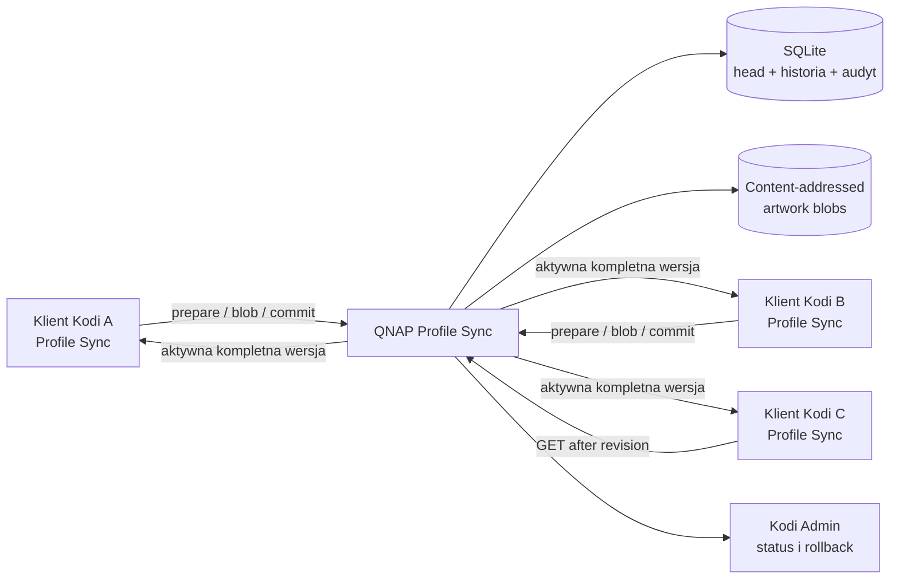

# Plan wielokierunkowej synchronizacji Kodi Favourites przez QNAP

Data: 2026-09-01

Status: `IMPLEMENTED_PENDING_LIVE_QUALIFICATION`

Niezależny audyt: `FAVOURITES_MULTIWRITER_SYNC_PLAN_REVIEW.md`.

## 1. Decyzja

Usunąć rolę Sony TV jako źródła nadrzędnego dla `favourites.xml`. Każda zapisana
instancja Kodi ma móc publikować zmianę ulubionych przez dodatek Profile Sync, a QNAP
ma przechowywać jedną autorytatywną wersję całego dokumentu.

Konflikty będą rozwiązywane prostym `last accepted write wins` (LWW): wygrywa kompletna
wersja, której commit QNAP zaakceptował jako ostatni. Nie będzie scalania pozycji,
tombstone'ów ani CRDT. Kolejność nadaje serwer, a nie zegary klientów.

Dynamiczne ulubione należy wydzielić z rewizji statycznej konfiguracji Profile Sync.
Pozostają transportowane przez tę samą usługę, enrollment, uwierzytelnienie i adapter
Kodi, lecz tworzą osobny strumień stanu `kodi.favourites`. Edycja `CARTOONS` nie może
powodować release'u wszystkich ustawień profilu.

Istniejący playback-state WatchNixtoons2/Rapideo jest bazą wspólnego silnika
synchronizacji stanu: enrollment, scope, idempotencja, monotoniczna rewizja/cursor,
retry, journal i obserwowalność. Favourites nie trafiają jednak do tabel ani dokumentu
playback. Playback działa per content key i odrzuca stale base, a favourites są jednym
whole-document LWW z blobami oraz inną semantyką apply. Wspólny jest transport i cykl
życia; walidator, storage adapter i conflict policy pozostają domenowe.

### Inwarianty

1. Head nigdy nie wskazuje dokumentu bez kompletu zweryfikowanych blobów.
2. Dokładnie jedna serializowana maszyna stanów obserwuje, publikuje albo stosuje
   favourites na danym kliencie.
3. Apply jest crash-recoverable i journaled, ale nie jest niewidoczne atomowo dla UI
   Kodi, ponieważ JSON-RPC przełącza pozycje kolejno.
4. Po aktywowaniu `dynamic_authority_fence` klient nie wraca samoczynnie do statycznego
   `kodi.favourites`; powrót wymaga jawnego rollbacku.
5. Sam start, restore albo re-enrollment nie może opublikować lokalnego dokumentu.
6. Każdy commit ma serwerową rewizję, digest żądania, zweryfikowany podpis urządzenia
   i audyt pochodzenia.
7. Klient nie może opublikować akcji Kodi spoza wspólnej allowlisty serwera i dodatku.
8. Klient ma najwyżej jedno niezmienne `inflight` i jedno koaleskowane
   `desired_latest`.

## 2. Stan obecny i problem

- `kodi.favourites` ma już kontrakt `kodi_favourites_v1`, własność
  `whole_document`, hot apply przez JSON-RPC oraz content-addressed artwork.
- QNAP Profile Sync rozprowadza podpisaną, aktywną rewizję do klientów.
- Pełny rollout eksportuje ulubione i grafiki z `KODI_SYNC_PUBLISHER`, którym obecnie
  jest Sony TV, i dopiero wtedy publikuje nową rewizję.
- Klient przy starcie i okresowo potrafi pobrać oraz zastosować rewizję, ale nie może
  sam opublikować lokalnej edycji.
- Zmiana na innym urządzeniu może zostać nadpisana przy kolejnej synchronizacji.

`CARTOONS` jest realizowane przez Kodi Favourites. Zakres synchronizacji pozostaje
celowo całym dokumentem ulubionych, nie filtrem nazw ani wyłącznie skrótami
WatchNixtoons2. Zapobiega to powstawaniu kilku niespójnych źródeł prawdy.

## 3. Cele i granice

### Cele

1. Publikacja lokalnej zmiany z dowolnego zapisanego klienta Kodi.
2. Automatyczne pobieranie zmian przy starcie i w krótkim cyklu okresowym.
3. Prosty, deterministyczny konflikt LWW bez merge.
4. Zachowanie istniejącej walidacji, limitów, journaled apply, rollbacku i grafik.
5. Brak zapętlenia: zastosowanie zmiany z QNAP nie może zostać odesłane jako nowa.
6. Odporność na restart, offline, ponowienie HTTP i częściowy upload.
7. Widoczność stanu w Kodi Admin oraz audyt pochodzenia każdej rewizji.

### Poza zakresem pierwszego wydania

- scalanie pojedynczych ulubionych;
- synchronizacja dowolnych plików lub całej konfiguracji skórki;
- synchronizacja cache, `Thumbnails/` albo baz danych Kodi;
- publiczny dostęp do strumienia stanu;
- push z QNAP do urządzeń za NAT. Klienci pozostają stroną inicjującą połączenie.

Jeżeli zakładka skórki `CARTOONS` okaże się osobnym plikiem menu/widgetu, powinna w
przyszłości dostać osobny allowlistowany adapter whole-document. Nie należy rozszerzać
tego planu na wszystkie ustawienia skórki.

## 4. Architektura docelowa



Podział odpowiedzialności:

| Moduł | Odpowiedzialność |
|---|---|
| Profile Sync addon | wykrycie lokalnej zmiany, trwały journal, upload, pull, hot apply i tłumienie echa |
| QNAP Profile Sync | autoryzacja, walidacja, atomowy commit, serwerowa kolejność LWW i historia |
| `kodi_favourites_v1` | kanoniczny dokument, limity, bezpieczne akcje i deskryptory artwork |
| Kodi Admin | head, pochodzenie, zbieżność klientów, błędy, historia i jawny rollback |
| `kodi_ops.py` | kwalifikacja infrastruktury i floty; bez eksportu z urządzenia nadrzędnego |

## 5. Kontrakt serwera

### 5.1 Namespace i capability

- namespace: `kodi.favourites`;
- payload adaptera pozostaje `kodi_favourites_v1`;
- nowa negocjowana capability: `favourites-state-lww-v1`;
- scope jest wyprowadzany po stronie serwera z enrollmentu; klient nie może podać
  dowolnego scope;
- serwer przechowuje osobne `favourites_state_enabled` oraz `favourites_scope_id`;
- zapis wymaga raportowanej capability, serwerowej flagi enabled, roli enrollmentu
  `publish` i bearer tokenu;
- lokalne `read_only` może wyłączyć writer klienta, ale nie jest autoryzacją serwera.

### 5.2 Transakcja publikacji

Użyć trzyetapowego protokołu, aby nie aktywować dokumentu przed dostarczeniem grafik:

1. `prepare` przyjmuje kanoniczny dokument, deskryptory blobów, digest payloadu,
   `base_server_revision`, losowy trwały `event_id`, lokalny numer zmiany,
   idempotency key i podpis urządzenia;
2. klient wysyła wyłącznie brakujące bloby do content-addressed storage;
3. `commit` ponownie waliduje komplet, atomowo zwiększa `server_revision`, ustawia head
   i zapisuje audyt w jednej transakcji SQLite.

`base_server_revision` służy do wykrycia i zaraportowania konfliktu, ale nie blokuje
commitu. Jest to świadoma semantyka LWW: później zaakceptowany kompletny zapis wygrywa.

Podpis jest związany z enrollmentem i jego generacją oraz obejmuje namespace, scope
generation, event ID, base revision, payload digest i deskryptory blobów. Zmiana
enrollmentu lub scope quarantinuje stary pending zamiast wysłać go w nowym zakresie.

Prepare tworzy losowy `session_id`, ma TTL i jawny status. Idempotency key jest
digestem kanonicznego żądania. Reuse z innym body zwraca `409`, a retry po timeout nie
tworzy drugiej rewizji. Wygaśnięcie sesji nie usuwa lokalnego eventu.

### 5.3 Odczyt

Klient odpytuje head z parametrem `after=<server_revision>`. Odpowiedź to:

- `NO_CHANGE`, albo
- descriptor podpisany dedykowanym kluczem `favourites-state-authority`, zawierający
  `server_revision`, payload digest, urządzenie źródłowe, czas przyjęcia przez serwer
  oraz listę wymaganych blobów.

Klient pobiera brakujące bloby, sprawdza digesty i dopiero wtedy wykonuje istniejący
journaled hot apply adaptera. Prywatny authority key jest montowany read-only w
kontenerze Profile Sync; publiczny trust bundle obsługuje overlap podczas rotacji.

### 5.4 Dane i retencja

Backend przechowuje:

- aktywny head per scope i namespace;
- monotoniczny `server_revision`;
- historię commitów z pochodzeniem, base revision i informacją o konflikcie;
- content-addressed bloby bez duplikatów;
- zdarzenia audytowe bez tokenów i treści credentiali.

Aktywny head, rollback pins, niewygasłe prepare sessions i ich bloby nie podlegają GC.
Rewizję/blob można usunąć dopiero, gdy jest starsza niż 30 dni **i** poza ostatnimi 20
rewizjami. Backup i GC używają wspólnego lease. Rollback w panelu tworzy nową,
monotoniczną rewizję wskazującą poprzedni payload; nie cofa licznika.

## 6. Algorytm klienta

### 6.1 Trwały stan lokalny

W prywatnym katalogu danych dodatku utrzymywać osobną bazę/journal zawierający:

- ostatni pobrany i zastosowany `server_revision`;
- digest ostatnio zastosowanego dokumentu;
- digest ostatnio zaobserwowanego stanu lokalnego;
- trwały lokalny numer zmiany;
- opcjonalny pending commit i etap transakcji;
- marker zdalnego apply służący do tłumienia echa.

Plik ten pozostaje device-local i nie może trafić do backupu ani rewizji profilu.

### 6.2 Start Kodi

1. Odczekać istniejący `startup_delay_seconds`.
2. Nowy/odtworzony klient pozostaje `UNINITIALIZED_READ_ONLY`, dopóki ręczny cutover
   nie wskaże istniejącego, zweryfikowanego dynamicznego head.
3. Dokończyć lub bezpiecznie ponowić przerwaną transakcję uploadu.
4. Pobrać head i zastosować go, jeżeli nie istnieje trwała lokalna zmiana
   wykryta wcześniej podczas pracy dodatku.
5. Jeśli trwała lokalna zmiana oczekuje, opublikować ją. Jej późniejszy commit wygrywa
   zgodnie z LWW.
6. Ustawić baseline, aktywować `dynamic_authority_fence` i uruchomić monitor.

Samo uruchomienie urządzenia ze starą kopią `favourites.xml` nie może tworzyć commitu.
Zmiana wykonana poza działającym dodatkiem jest traktowana jako niejednoznaczna i nie
jest automatycznie publikowana; panel dodatku może później dostać jawną akcję
„Opublikuj lokalne ulubione”.

### 6.3 Serializowana maszyna stanów

```text
UNINITIALIZED_READ_ONLY
  -> PULL_HEAD -> DOWNLOAD -> APPLY -> VERIFY -> HEALTHY
HEALTHY
  -> LOCAL_DEBOUNCE -> PENDING -> PREPARE -> UPLOAD -> COMMIT -> CONFIRM -> HEALTHY
HEALTHY
  -> REMOTE_AVAILABLE -> CAPTURE_LOCAL -> DOWNLOAD -> APPLY -> VERIFY -> HEALTHY
any
  -> ERROR_RETRYABLE | QUARANTINED
```

Przed każdym zdalnym apply arbiter wykonuje stabilny odczyt lokalny. Wykryta zmiana
jest zapisywana jako pending przed pierwszym togglem i blokuje apply. Marker remote
apply jest zapisany przed pierwszym togglem, współdzieli obecny `apply-journal.json` i
znika dopiero po read-after-write verification. Nowa edycja podczas uploadu nie zmienia
`inflight`; aktualizuje tylko `desired_latest`.

### 6.4 Wykrywanie zmiany

- odczytywać kanoniczną listę przez JSON-RPC, wykorzystując istniejący adapter;
- sprawdzać hash co około 15 sekund;
- wymagać dwóch zgodnych odczytów i co najmniej 10 sekund debounce;
- pusta lista lub duży spadek liczby pozycji wymaga readiness Kodi oraz 4 zgodnych
  odczytów przez minimum 60 sekund; transient `null` nie może zostać opublikowany;
- zmiana różna od baseline tworzy trwały pending commit;
- dodać `PortableFavouritesExporter` działający w Kodi. Kolejność pozycji jest
  znacząca, deskryptory artwork są sortowane po digest, a pola zmienne pomijane;
- V1 publikuje istniejące local-CAS; stabilne zewnętrzne HTTPS pozostawia jako URL.
  Nie pobiera dowolnych zdalnych obrazów. `image://` i zasoby dodatków muszą zostać
  odwzorowane na local-CAS albo bezpieczny URL, w przeciwnym razie zapis jest blokowany;
- identyczny digest jest `NO_CHANGE` i nie zapisuje serwera.

Dynamiczny kontrakt jest kanonicznym JSON. XML jest używany tylko przez ręczny seed.

### 6.5 Pobieranie i konwergencja

- sprawdzenie zdalnego head po lokalnym zdarzeniu oraz co 2–5 minut z jitterem;
- sześciogodzinny cykl statycznych ustawień pozostaje niezależny, ale po cutover pomija
  adapter favourites;
- przy niedostępnym QNAP lokalna edycja pozostaje w journalu i nie blokuje Kodi;
- po odzyskaniu sieci pending commit jest ponawiany idempotentnie;
- po apply klient wysyła dedykowany `favourites-state/ack` z revision, digest, wynikiem,
  pending count i czasem sukcesu, bez treści favourites.

### 6.6 Dynamic authority fence

Ręczny cutover enrollmentu jest dozwolony tylko, gdy dynamiczny head istnieje i został
zweryfikowany. Wtedy klient trwale zapisuje fence. `TransactionalApplier` pomija odtąd
`kodi.favourites` w statycznych rewizjach i nadal stosuje pozostałe adaptery. Brak
dynamicznego head jest fail-closed. Wyłączenie fence jest jawną operacją rollbacku.

## 7. Konflikty

| Scenariusz | Wynik |
|---|---|
| A zmienia, potem B pobiera | B stosuje wersję A |
| A i B zmieniają równocześnie | wygrywa commit później przyjęty przez QNAP |
| B edytuje offline i wraca | jego oczekujący commit staje się nowym head |
| stare urządzenie tylko się uruchamia | pobiera head; niczego nie publikuje |
| timeout po commit | idempotency zwraca tę samą rewizję |
| apply z QNAP zmienia lokalny hash | marker remote apply tłumi upload zwrotny |
| administrator wykonuje rollback | powstaje nowa rewizja, którą pobierają wszystkie klienty |

W panelu należy pokazywać, że LWW oznacza kolejność przyjęcia przez QNAP, nie czas
edycji według zegara urządzenia.

## 8. Bezpieczeństwo i limity

- wykorzystać istniejące TLS, enrollment access token, logical device ID i scope;
- wymagać podpisu prepare/commit kluczem urządzenia związanym z enrollment generation;
- nie dodawać sekretów do payloadu ani logów;
- zachować obecne ograniczenia liczby ulubionych, wielkości dokumentu i blobów;
- ponownie walidować XML/JSON, akcje Kodi, typ MIME, digest i content-addressed nazwę;
- odrzucać symlinki, traversal, niedozwolone URI i niepełne zestawy blobów;
- limitować prepare/commit per enrollment i całkowity rozmiar scope;
- nie ufać `accepted_at` ani numerowi rewizji przesłanemu przez klienta;
- wspólna allowlista klient/serwer odrzuca `android` i arbitralny `RunScript`; `window`
  ogranicza do obsługiwanych okien, a `media`/`plugin://` do jawnych addon IDs oraz
  bezpiecznych parametrów;
- poprawny podpis urządzenia nie zastępuje walidacji serwerowej. Threat model zakłada,
  że przejęty writer może nadpisać dokument; skutki ograniczają allowlista, revocation,
  historia, rate limit i rollback;
- backup QNAP musi obejmować spójny snapshot SQLite oraz wszystkie osiągalne bloby;
- Control Plane ma alarmować o niespójnym head, brakującym blobie, serii odrzuceń i
  klientach pozostających za head, ale nie o zwykłym urządzeniu offline.

Limity V1: 256 pozycji i blobów, 8 MiB na blob, 64 MiB na commit, 512 MiB na scope,
4 aktywne prepare sessions per enrollment i 20 commitów na godzinę.

## 9. Zmiany modułów

### QNAP Profile Sync

- schema bazy i migracja atomowa;
- repozytorium blobów oraz GC;
- endpointy prepare/upload/commit/get/history/rollback;
- capability i autoryzacja per enrollment;
- backup/restore drill nowego stanu;
- metryki i healthcheck kompletności head.

Wspólne prymitywy z playback-state należy wydzielić jako mały `ScopedStateEngine`:
autoryzacja enrollment/scope, idempotency ledger, monotoniczny cursor, retry-safe
transaction i integration snapshot. Playback oraz favourites zachowują własne tabele,
walidatory i conflict policy. Nie należy robić generycznego silnika dowolnych payloadów.

### Dodatek Profile Sync

- monitor ulubionych i debounce;
- trwały journal oraz idempotentne wznowienie;
- klient nowego API i pobieranie blobów;
- integracja z istniejącym `PortableFavouritesAdapter`;
- `PortableFavouritesExporter`, wspólne wektory allowlisty i destructive debounce;
- suppress-echo, dedykowany ack i dynamic authority fence;
- feature flag per enrollment.

### Kodi Admin

- bieżący head, digest, czas i urządzenie źródłowe;
- zbieżność `applied_server_revision` per klient;
- pending/failed uploads bez ujawniania treści;
- historia konfliktów i przycisk rollback z potwierdzeniem;
- akcja wymuszenia pull, ale bez zdalnego arbitralnego zapisu plików.

Stany panelu: `DISABLED`, `UNINITIALIZED`, `HEALTHY`, `PENDING_UPLOAD`, `APPLYING`,
`CONFLICT_ACCEPTED`, `ERROR` i `QUARANTINED`. Lag alarmuje tylko dla świeżego klienta.
Rollback używa istniejącej kolejki akcji, ponownego potwierdzenia/TOTP, idempotency i
pełnego audytu aktora.

### Operacje i dokumentacja

- `kodi_ops.py rollout` ma kwalifikować dynamiczny head i zbieżność, bez eksportu z
  Sony TV;
- usunąć wymóg `KODI_SYNC_PUBLISHER` dopiero po zakończeniu migracji;
- zachować narzędzie jednorazowego seed/bootstrapu z lokalnego bundle;
- zaktualizować dokumenty architektury, Profile Sync, operacji, backupu, panelu i E2E.

## 10. Migracja i rollout

### Faza A — kompatybilny backend

1. Dodać schema i API za wyłączoną flagą zapisu.
2. Wdrożyć na QNAP i wykonać migrację dry-run, backup oraz restore drill.
3. Wdrożyć authority key, publiczny trust overlap oraz serwerową flagę/scope.
4. Nie wykonywać automatycznej migracji danych ani dual-write.

### Faza B — kompatybilny klient

1. Wydać Profile Sync z readerem nowego strumienia i writerem domyślnie wyłączonym.
2. Przed ręcznym cutover klient używa wyłącznie starego statycznego adaptera.
3. Ręcznie wyeksportować jeden zweryfikowany seed z bieżącego bundle i utworzyć head.
4. Ręcznie włączyć capability i fence dla BlueStacks oraz X88.
5. Po fence klient używa wyłącznie dynamicznego head dla favourites; nie ma dual-read.
6. Potwierdzić no-op oraz brak podwójnego apply.

### Faza C — multi-writer canary

1. Włączyć capability zapisu wyłącznie dla BlueStacks i X88.
2. Wykonać scenariusze jedno- i dwukierunkowe, offline oraz konflikty.
3. Potwierdzić statusy w Kodi Admin, backup/restore i brak regresji playback-state.

### Faza D — pełna flota

1. Ręcznie włączyć capability/fence kolejnym zapisanym klientom po potwierdzeniu head.
2. Wykonać full rollout Android oraz NUC/Flatpak tym samym orkiestratorem.
3. Potwierdzić wspólny head, artwork i heartbeat na każdym dostępnym urządzeniu.
4. Urządzenia offline pozostają jawnie `DEFERRED` i konwergują po następnym starcie.

### Faza E — usunięcie publishera

Po udanych E2E i pełnym rolloutcie:

- usunąć rolę publishera i `KODI_SYNC_PUBLISHER` z aktywnego kontraktu;
- usunąć eksport z Sony TV z normalnej ścieżki full rollout;
- pozostawić jawne, administracyjne narzędzie bootstrap/import;
- usunąć dual-read dopiero po potwierdzeniu, że wszystkie wspierane klienty mają nową
  capability; każdy aktywny enrollment musi zostać ręcznie przełączony albo jawnie
  `revoked`/`retired`; samo `DEFERRED` nie wystarcza;
- oznaczyć stary model w lifecycle jako wycofany i usunąć go w osobnym, testowanym
  kroku, a nie razem z pierwszym wdrożeniem.

Nie budować automatycznego migratora dla tej jednorazowej operacji. Obsługiwany jest
mały, jawny skrypt operatora `seed` oraz `cutover-enrollment`, oba z dry-run, dokładnym
targetem, backupem i raportem. To ogranicza implementację i usuwa niebezpieczny
automatyczny dual-read.

## 11. Testy

### Jednostkowe i kontraktowe

- canonical hash i identyczny no-op;
- prepare bez blobów, błędny digest, traversal, limit i nieznany adapter;
- idempotentne retry prepare/upload/commit;
- monotoniczna rewizja i atomowa zmiana head;
- konflikt base revision oraz późniejszy commit wygrywający w całości;
- suppress-echo i przerwany journal na każdym etapie;
- migracja statycznego adaptera do identycznego dynamicznego head;
- retencja/GC nieusuwające aktywnych blobów;
- uprawnienia read-only, obcy scope i unieważniony enrollment;
- rollback tworzący nową rewizję;
- podpis urządzenia, generation/scope change, replay i rotacja authority key;
- identyczne wektory allowlisty klienta i serwera;
- fence blokujący późniejszy apply statycznego favourites;
- dwa połączenia SQLite tworzące dokładnie monotoniczny head;
- backup równoległy z GC oraz prepare session;
- regresja wspólnych prymitywów playback-state.

### E2E BlueStacks i X88

1. Seed obecnej listy i porównanie semantycznego hasha oraz wszystkich grafik.
2. Dodanie skrótu na BlueStacks i automatyczne pojawienie się na X88.
3. Usunięcie/zmiana na X88 i automatyczna konwergencja BlueStacks.
4. Dwie różne zmiany offline, kontrolowana kolejność commitów i dowód LWW.
5. Restart starego klienta bez edycji — brak publikacji.
6. Restart w połowie uploadu — dokładnie jedna rewizja po wznowieniu.
7. Awaria QNAP, lokalna zmiana, odzyskanie QNAP i poprawne opróżnienie journala.
8. Uszkodzony blob i dokument — fail closed, poprzedni head pozostaje aktywny.
9. Rollback z panelu i konwergencja obu klientów.
10. Regresja Umbrella, WatchNixtoons2 playback-state, Rapideo, YouTube, statycznych
    ustawień Profile Sync, pełnego repo E2E i restore bez cache.
11. Fault injection po prepare, każdym blobie, commit i każdym togglu JSON-RPC.
12. Druga lokalna edycja podczas inflight i koaleskowanie `desired_latest`.
13. Transient `null`, świadome usunięcie ostatniej pozycji i destructive debounce.
14. Re-enrollment/scope change quarantinujące stary pending.
15. Statyczny apply po dynamic fence — favourites pozostają bez zmian.

### Pełny rollout

- po stabilizacji BlueStacks/X88 wdrożyć na wszystkie dostępne urządzenia;
- porównać dokładny `server_revision`, canonical hash, liczbę ulubionych i artwork;
- sprawdzić start Kodi oraz okresowy pull;
- nie wydawać osobnej wersji per urządzenie;
- release wykonywać dopiero po zielonym CI, E2E canary i kwalifikacji QNAP.

## 12. Rollback wdrożenia

1. Wyłączyć `favourites-state-lww-v1` dla zapisów, pozostawiając odczyt.
2. Przypiąć ostatni zdrowy dynamiczny head.
3. W razie awarii readera przywrócić klientom statyczny `kodi.favourites` z aktywnej
   rewizji.
4. Do czasu zakończenia fazy E zachować administracyjny bootstrap z istniejącego
   content-addressed bundle.
5. Nie usuwać historii ani blobów podczas rollbacku.

Po migracji schema zwykły rollback oznacza wyłączenie flagi na nowym obrazie. Downgrade
obrazu wymaga restore pre-migration backupu i świadomie traci późniejsze commity.

### Topologia release

1. `mwoDevelop/kodi-profile-sync-server` — schema, API, authority i backup.
2. `mwoDevelop/service.mwodevelop.profilesync` — reader, writer, exporter i fence.
3. `mwoDevelop/kodi-control-plane` — statusy, akcje i rollback.
4. `mwoDevelop/kodi` — submodule, locki, QNAP images, orkiestrator i rollout.

Każdy obraz, ZIP, lock i raport E2E musi wskazywać dokładny commit przeznaczony do
wydania; release nie może powstać z brudnego katalogu roboczego.

## 13. Kryteria ukończenia

- żadne urządzenie nie ma roli stałego publishera;
- lokalna edycja na BlueStacks lub X88 dociera do drugiego klienta bez rolloutu;
- konflikt jest rozstrzygany ostatnim commitem serwera i nie tworzy pętli;
- stare urządzenie po starcie nie nadpisuje aktualnego head;
- grafiki pozostają kompletne po sync, restarcie oraz cache-free restore;
- QNAP backup/restore zachowuje head, historię i bloby;
- Kodi Admin pokazuje prawdziwy head i zbieżność klientów;
- wszystkie dostępne urządzenia przechodzą rollout i E2E;
- `kodi_ops.py` nie wymaga `KODI_SYNC_PUBLISHER` w normalnej ścieżce;
- dokumentacja operatora i architektury opisuje nowy model oraz semantykę LWW.
