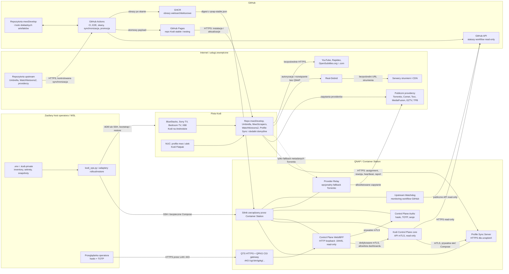
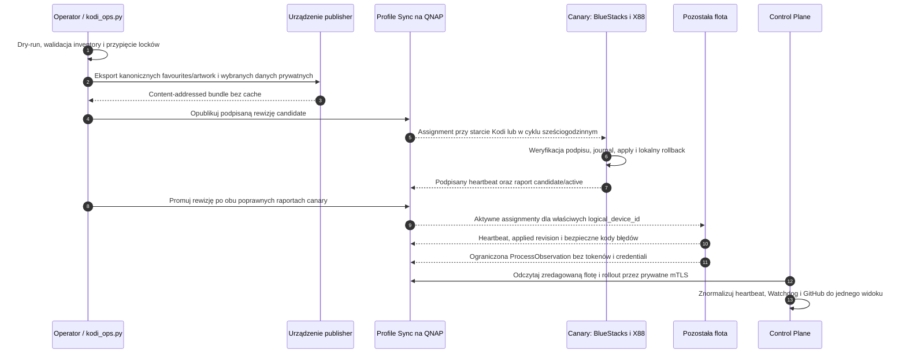
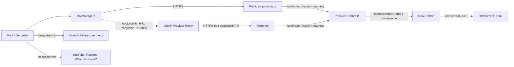

# Architektura rozwiązania mwoDevelop Kodi

Ten dokument opisuje **aktualnie działające** rozwiązanie: komponenty, miejsca ich
uruchomienia, kanały komunikacji i źródła prawdy. Nie opisuje funkcji planowanych jako
już wdrożonych. W szczególności panel QNAP Control Plane pozostaje tylko do odczytu,
a sekrety i administracyjny rollout nadal należą do zaufanego hosta operatora.

Dokładne wersje dodatków i digesty obrazów nie są powielane w tym dokumencie. Ich
autorytatywnymi źródłami są odpowiednio `manifests/locks/stable.json` oraz
`manifests/locks/qnap-stable.json`.

## 1. Widok całego systemu



### 1.1 Macierz komunikacji runtime

| Nadawca | Odbiorca | Kanał | Przenoszone dane | Rola |
|---|---|---|---|---|
| Repozytorium Kodi na urządzeniu | GitHub Pages | HTTPS | Indeks, metadane i ZIP-y stable/testing | Instalacja i aktualizacja kodu dodatków |
| Profile Sync w Kodi | Profile Sync na QNAP | HTTPS z walidacją prywatnego CA, token urządzenia i podpisy | Assignment, rewizja, heartbeat, raport zastosowania i opt-in playback LWW | Rutynowa synchronizacja konfiguracji i stanu WatchNixtoons2 |
| Control Plane | Integration API Profile Sync | Prywatne mTLS na `mwodevelop-control:8767` | Zredagowana flota, rollouty i liczniki playback | Dashboard i obserwowalność |
| Control Plane | GitHub API | HTTPS read-only | Statusy workflow i harmonogramów | Dashboard i freshness |
| Upstream Watchdog | GitHub API | HTTPS, publiczny odczyt | Ostatnie wyniki 11 workflow | Alarm fail-closed |
| Przeglądarka operatora | QTS HTTPS / QPKG CGI → Control Plane Web/BFF | HTTPS `:443/cgi-bin/qpkg/KodiCPGateway/gateway.cgi/control-plane/`, następnie HTTP tylko po loopback `:19445`; zweryfikowany admin `NAS_SID` albo ręczne hasło+TOTP, sesja i CSRF | Statyczny panel i odczytowe API | Administracyjny podgląd bez certyfikatu klienta i bez osobnego CA panelu |
| Control Plane Web/BFF | Control Plane core | Prywatne mTLS, certyfikat o ograniczonym scope | Wyłącznie endpointy dashboardu | Separacja przeglądarki od API operatorskiego |
| Control Plane Web/BFF | Control Plane Authz | Prywatne mTLS bez portu LAN | Bootstrap, login, sesja, recovery | Uwierzytelnienie przeglądarkowe |
| Host operatora | QNAP | SSH, następnie bezpieczny Docker Compose | Przypięte digesty i konfiguracja wdrożenia | Build/deploy/status kontenerów |
| Host operatora | Kodi Android / Kodi Flatpak | ADB / SSH | Bootstrap, prywatne ustawienia, rollout, restore i sondy | Administracja, która nie jest jeszcze autonomiczna |
| MwoScrapers | Publiczni providerzy | HTTPS | Metadane wyszukiwania i kandydaci torrentów | Standardowa ścieżka wyszukiwania |
| MwoScrapers | Provider Relay na QNAP | HTTP po prywatnym LAN, opcjonalnie | Allowlistowane zapytanie Torrentio bez sekretów RD | Obejście blokady adresu wyjściowego VPN |
| Provider Relay | Torrentio | HTTPS | To samo ograniczone zapytanie metadanych | Publiczny upstream relaya |
| Umbrella | Real-Debrid | Bezpośrednie HTTPS z urządzenia | Autoryzacja, hash/magnet i wynik rozwiązania | Rozwiązanie źródła do strumienia |
| Odtwarzacz Kodi | Serwer strumienia/CDN | Bezpośrednie HTTPS | Materiał wideo | Odtwarzanie bez udziału QNAP |
| Kodi i dodatki | YouTube, Rapideo, OpenSubtitles i WatchNixtoons2 | Bezpośrednie HTTPS | API właściwe dla usługi | Funkcje niezależne od Control Plane |

## 2. Gdzie działają komponenty

### 2.1 GitHub i publiczna dystrybucja

| Komponent | Miejsce | Odpowiedzialność |
|---|---|---|
| `mwoDevelop/kodi` | GitHub | Skład repozytorium Kodi, locki stable/testing, manifesty, orchestrator, testy i dokumentacja |
| Fork Umbrella | GitHub + submoduł `umbrella/` | Minimalny downstream patch stack odtwarzany na aktualnym upstream |
| MwoScrapers | GitHub + submoduł `mwoscrapers/` | Provider API, sześciu providerów, menedżer ustawień i obraz przekaźnika |
| Fork WatchNixtoons2 | GitHub + submoduł `watchnixtoons2/` | Izolowany dodatek mwoDevelop i kontrolowana synchronizacja upstream |
| Profile Sync add-on | GitHub + submoduł `profile-sync-addon/` | Klient synchronizacji i źródło ograniczonej telemetrii procesu działające wewnątrz Kodi |
| OpenSubtitles.com add-on | GitHub + submoduł `opensubtitles-com/` | Zarządzany klient API OpenSubtitles.com dla całego Kodi |
| GitHub Actions | GitHub-hosted runners | Testy, skany malware/secrets/SAST, budowanie repo i obrazów, propozycje upstream oraz promocja |
| GitHub Pages | `https://mwodevelop.github.io/kodi/` | Jeden atomowy payload repozytoriów Kodi stable/testing i publicznych statusów |
| GHCR | GitHub Container Registry | Niezmienne, wieloarchitekturowe obrazy czterech usług QNAP |

Repozytorium Kodi nie buduje dodatków z „najnowszego brancha”. Każdy kanał jest
składany z dokładnych commitów i SHA-256 zapisanych w odpowiednim locku. Kanał
`testing` służy kwalifikacji, a `stable` jest instalowany na urządzeniach.

### 2.2 QNAP / Container Station

Na QNAP działa jeden silnik zarządzany przez Container Station. Kontenery nie mają
dostępu do Docker socketa, działają bez dodatkowych capabilities i są uruchamiane z
digestów zapisanych w `qnap-stable.json`.

| Usługa | Interfejs | Stan i dane |
|---|---|---|
| `control-plane` | LAN `HTTPS/mTLS :19443`; wewnętrzne `/ready` | Agreguje zredagowany stan floty, rolloutów, usług, harmonogramów i audytu. Maszynowy dashboard oraz API są tylko do odczytu. Własna baza SQLite |
| `KodiCPGateway` + `control-plane-web` | QTS `HTTPS :443/cgi-bin/qpkg/KodiCPGateway/gateway.cgi/control-plane/` → CGI → `127.0.0.1:19445`; prywatne mTLS BFF do core/authz | Bezusługowy QPKG rejestruje skrót **Kodi admin** i CGI bez `app_proxy.conf`. CGI najpierw weryfikuje cookie sesyjne przez loopback; wygasłą sesję odnawia po walidacji administratorskiego `NAS_SID`, wykonując istniejący login z TOTP serwer-serwer. Prywatne pliki `0600` są poza WWW. Read-only BFF nadal wymusza Host/Origin, CSRF i sesję, a backend nie ma portu w LAN ani dostępu do sekretów floty |
| `control-plane-authz` | Brak opublikowanego portu; prywatne mTLS | Hasło scrypt, TOTP, recovery codes, rate limit i sesje. Osobna baza SQLite; seed TOTP szyfrowany AES-GCM |
| `profile-sync` | LAN `HTTPS :18765`; prywatne mTLS `:8767` tylko w sieci Compose | Enrollmenty, podpisane rewizje i assignmenty, heartbeat oraz raporty zastosowania. Trwała baza SQLite/blob |
| `provider-relay` | Prywatny adres LAN `HTTP :18766` | Bezstanowy, opcjonalny fallback wyłącznie dla allowlistowanych zapytań providerów, obecnie przede wszystkim Torrentio |
| `upstream-watchdog` | Brak opublikowanego portu | Co sześć godzin sprawdza 11 cyklicznych workflow GitHub; healthcheck QTS odczytuje wynik co pięć minut |

`control-plane` komunikuje się z `profile-sync` przez prywatną zewnętrzną sieć
Compose `mwodevelop-control` i osobne mTLS. Nie montuje bazy Profile Sync. Watchdog
nie przekazuje danych do urządzeń i nie może naprawiać ani uruchamiać workflow.

Procesy cykliczne są prezentowane we wspólnym modelu `ProcessObservation`. Adapter
GitHub Actions obserwuje harmonogramy workflow, Watchdog publikuje własny stan
kolektora, a Profile Sync przekazuje z urządzenia ostatnią próbę, sukces i termin
retry. Control Plane zachowuje źródłowe pola na potrzeby alertów, lecz w panelu
pokazuje dla wszystkich źródeł te same osie: obserwator, wynik, świeżość i termin.

### 2.3 Zaufany host operatora

Repozytorium robocze działa w WSL pod `/home/mwo/projects/kodi`. Host pozostaje
aktualnym miejscem wykonywania administracji:

- `.env` przechowuje członkostwo floty, osiągalne endpointy i referencje do sekretów;
- `.kodi-private/` przechowuje prywatny inventory, snapshoty, tokeny, sesję YouTube,
  bundle portable state, raporty operacji i materiały bootstrapu;
- `tools/kodi_ops.py` składa dry-run, release, rollout i restore;
- `tools/qnap_images.py` buduje lub wdraża zatwierdzone obrazy QNAP;
- adaptery Android używają dedykowanego lokalnego demona ADB, a adaptery NUC — SSH;
- przeglądarka operatora otwiera dashboard przez standardowy HTTPS QTS pod
  `/cgi-bin/qpkg/KodiCPGateway/gateway.cgi/control-plane/`; aktywna sesja
  administratora QTS uruchamia bezpieczny login serwer-serwer, a wejście
  bez niej zachowuje ręczne hasło i TOTP; interfejs
  maszynowy na `:19443` nadal wymaga certyfikatu klienta mTLS.

Sekrety nie są publikowane do GitHub, GitHub Pages, GHCR ani raportów E2E. Planowane
przeniesienie administracji i zaszyfrowanych sekretów do QNAP nie jest jeszcze
wdrożoną funkcją Control Plane.

### 2.4 Urządzenia Kodi

Prywatny rejestr obejmuje sześć logicznych instalacji. Adresy są celowo poza Git i
pochodzą z `.env`; tożsamość nie zależy od bieżącego IP.

| Identyfikator logiczny | Platforma i miejsce uruchomienia |
|---|---|
| `bluestacks1` | Kodi Android w emulatorze BlueStacks na hoście Windows |
| `sony-tv` | Kodi Android TV na telewizorze Sony |
| `bedroom-tv` | Kodi Android TV na Google TV box |
| `x88pro20` | Kodi Android TV na X88 Pro 20 |
| `nuc-mwo` | Kodi Flatpak w sesji użytkownika `mwo` na NUC |
| `nuc-alek` | Niezależny profil Kodi Flatpak użytkownika `alek` na tym samym NUC |

Standardowy zestaw zarządzany obejmuje:

- `repository.mwodevelop` stable;
- Umbrella (mwoDevelop), moduł MwoScrapers i widoczny MwoScrapers Manager;
- WatchNixtoons2 (mwoDevelop) oraz mwoDevelop Profile Sync;
- zarządzany OpenSubtitles.com;
- oficjalne lub zewnętrzne dodatki objęte polityką: YouTube, Rapideo i
  OpenSubtitles.org wraz z ich przypiętymi zależnościami.

Rzeczywistą wersję na urządzeniu potwierdza audyt/rollout; sam wpis w manifeście nie
jest dowodem, że chwilowo niedostępne urządzenie zdążyło się zaktualizować.

## 3. Jak dostarczany jest kod

```mermaid
sequenceDiagram
  autonumber
  participant U as Upstream
  participant A as GitHub Actions
  participant F as Fork mwoDevelop
  participant K as mwoDevelop/kodi
  participant T as Kanał testing
  participant S as Kanał stable
  participant P as GitHub Pages
  participant D as Kodi na urządzeniu

  A->>U: Pobierz dokładny commit lub przypięty artefakt
  A->>A: Walidacja struktury, SHA-256 i pełny skan zawartości
  A->>F: Utwórz lub odśwież ograniczony PR
  Note over F: Review i zielone CI; brak bezwarunkowego merge
  K->>F: Odczytaj commit wskazany przez manifest komponentu
  A->>T: Zbuduj deterministyczny snapshot kandydata
  A->>A: E2E, skan dokładnych bajtów i atestacja
  A->>S: Promuj przez review dokładny lock, bez przebudowy artefaktu
  A->>P: Opublikuj atomowo stable, testing i manifest SHA-256
  D->>P: Kodi pobiera indeks repo i ZIP dodatku po HTTPS
  D->>D: Kodi instaluje lub aktualizuje dodatek
```

Umbrella ma dodatkową, ściśle ograniczoną ścieżkę automatycznej propozycji i
approval. Pozostałe komponenty wymagają review. Kandydat WatchNixtoons2, który nie
przechodzi bramy bezpieczeństwa, pozostaje poza stable; działające urządzenia nadal
korzystają z ostatniej zatwierdzonej wersji.

Obrazy QNAP przechodzą analogiczny proces: źródłowy commit buduje obraz w GitHub
Actions, skan i approval wiążą digest z inputami, `qnap-stable.json` promuje dokładny
digest, a dopiero hostowy rollout wdraża go przez Container Station.

## 4. Jak synchronizowana jest konfiguracja



Profile Sync synchronizuje wyłącznie podpisaną, allowlistowaną konfigurację
rutynową: wybrane ustawienia Kodi/Umbrella, kanoniczne favourites i lokalne grafiki
WatchNixtoons2. Osobny opt-in `playback-state-lww-v1` synchronizuje dla tego dodatku
małe rekordy watched/resume przez serwerowe rewizje i prostą zasadę remote-wins dla
starego eventu; nie kopiuje bazy `MyVideos`. Umbrella zachowuje Trakt jako źródło
prawdy, a YouTube zdalną historię konta. Każde urządzenie ma własny enrollment, token i klucz podpisujący;
nie są one klonowane przez backup.

Osobną warstwą pozostają sekrety i pełne odtworzenie:

- Real-Debrid, Rapideo, OpenSubtitles oraz sesja OAuth YouTube pochodzą z prywatnych
  plików hosta i są stosowane przez jawny rollout/restore;
- zwykły cykl Profile Sync nie rozsyła credentiali ani kodu dodatków;
- dodatki aktualizują się z repo Kodi stable, a nie z payloadu Profile Sync;
- pełny disaster-recovery snapshot zawiera kod i trwałe `addon_data`, ale wyklucza
  cache, bazy odbudowywalne oraz lokalną tożsamość Profile Sync.

## 5. Jak działa wyszukiwanie i odtwarzanie



Najważniejsza granica: QNAP nie jest wymagany do normalnego rozwiązywania magnetów,
logowania do Real-Debrid ani przesyłania strumienia. Provider Relay jest obejściem
sieciowym dla zapytania metadanych, gdy publiczny Torrentio odrzuca adres wyjściowy
VPN urządzenia. Publiczny endpoint Torrentio pozostaje fallbackiem. Comet i inni
providerzy, Real-Debrid oraz końcowy materiał nie przechodzą przez relay.

NordVPN lub OpenVPN działa lokalnie na wybranych urządzeniach Android. Routing VPN i
wyłączenie LAN decydują, czy urządzenie może jednocześnie osiągnąć QNAP. VPN nie jest
kontenerem ani dodatkiem zarządzanym przez Control Plane.

## 6. Obserwowalność i status

Control Plane odświeża widoki Profile Sync i ogólny stan GitHub co minutę, a katalog
harmonogramów co 15 minut. Dashboard rozdziela trzy rzeczy:

1. czy scheduler istnieje;
2. jaki był wynik ostatniego uruchomienia;
3. czy obserwacja jest jeszcze świeża.

Awaria GitHub albo Profile Sync nie usuwa ostatniego poprawnego snapshotu. Control
Plane oznacza źródło jako `degraded`, zachowuje provenance i zapisuje bezpieczny kod
błędu. Watchdog działa fail-closed: sprawny proces może celowo mieć stan `unhealthy`,
jeśli monitorowany workflow rzeczywiście zakończył się błędem.

Control Plane nie ma obecnie endpointów mutujących, dostępu do Docker socketa,
klucza promotora ani sekretów floty. API maszynowe wymaga certyfikatu klienta
mTLS. Browser BFF jest osobnym procesem, ograniczonym do LAN i endpointów
dashboardu, i wymaga hasła+TOTP.

## 7. Źródła prawdy

| Pytanie | Źródło prawdy |
|---|---|
| Co publikuje stable/testing? | `manifests/locks/stable.json`, `testing.json` i publiczny `artifact-manifest.sha256` |
| Jakie obrazy wolno wdrożyć na QNAP? | `manifests/locks/qnap-stable.json` |
| Gdzie leży źródło dodatku? | `manifests/components.json` i przypięte submoduły |
| Które procesy są cykliczne? | `.github/workflows/` oraz `manifests/control-plane-schedules.json` |
| Co obserwuje watchdog? | `manifests/upstream-watchdog.json` |
| Które urządzenia należą do floty i gdzie są? | prywatne `.env` i `.kodi-private/devices.json` |
| Co synchronizuje profil? | `manifests/kodi-profile-policy.json` i aktywna podpisana rewizja Profile Sync |
| Jaki jest aktualny stan runtime? | live `tools/qnap_images.py status`, dashboard Control Plane i audyt urządzeń |

## 8. Granice aktualnego wydania

Zaimplementowane są: deterministyczne repo stable/testing, kontrolowana synchronizacja
upstream, skany, obrazy QNAP, Profile Sync z podpisanymi rewizjami i raportami,
hostowy rollout/restore, provider relay, watchdog oraz read-only dashboard mTLS.

Jeszcze nie są zaimplementowane jako produkcyjne funkcje:

- przechowywanie wszystkich sekretów w QNAP Control Plane;
- logowanie administratora WebAuthn i mutujące akcje w GUI;
- autonomiczny rollout całej konfiguracji bez udziału hosta operatora;
- zdalny reinstall Kodi inicjowany z panelu;
- przesyłanie kodu dodatków albo cache przez Profile Sync.

Rozwinięcie tych granic opisuje
[plan QNAP Control Plane i konwergencji urządzeń](../QNAP_CONTROL_PLANE_DEVICE_CONVERGENCE_PLAN.md).

## 9. Weryfikacja na żywo

Poniższe polecenia nie ujawniają sekretów:

```bash
# Cztery obrazy i ich stan w Container Station
.venv/bin/python tools/qnap_images.py status

# Kontrakt i certyfikaty read-only Control Plane
.venv/bin/python tools/qnap_control_plane.py verify-api --references .env

# Członkostwo logicznej floty bez endpointów
.venv/bin/python tools/kodi_devices.py validate

# Plan pełnego rolloutu bez zmian
.venv/bin/python tools/kodi_ops.py rollout --dry-run

# Spójność dokumentacji i linków
.venv/bin/python -m pytest -q tests/test_documentation.py
```

Szczegółowe procedury znajdują się w [operacjach Kodi](kodi-operations.md),
[prywatnych profilach](kodi-private-profile.md), [procesach cyklicznych](scheduled-processes.md)
i [cyklu życia obrazów QNAP](qnap-images.md). Architektura wewnętrzna samego panelu
znajduje się w [dokumentacji Control Plane](control-plane/architecture.md).
