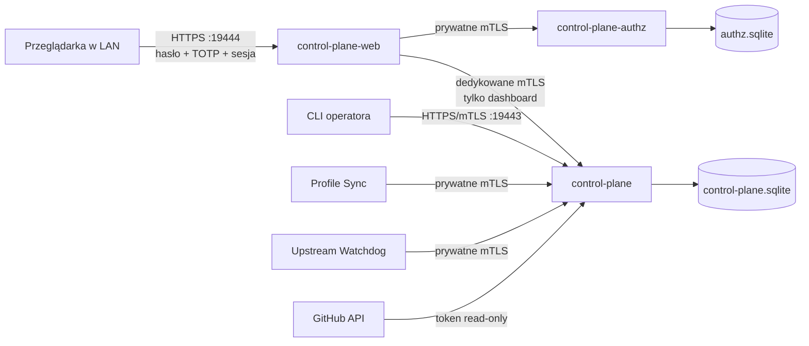

# Architektura QNAP Control Plane

## Aktualny przyrost: read-only dashboard z authz, API mTLS i lokalny writer bundle

Control Plane utrwala zredagowane snapshoty operacyjne oraz własne, niemutowalne
bundle desired state. Nie montuje bazy
Profile Sync, nie montuje Docker socketu i nie dostaje klucza publishera,
promotora ani administratora. Nie może też wywołać żadnej mutacji HTTP.

Lokalny CLI QNAP realizuje `PREPARING -> READY -> PUBLISHED`. `READY` wymaga
dowodu wiążącego dokładny commit, lock, indeks, artifact manifest, atestację i
drzewa komponentów. Publikacja head używa oczekiwanej generacji (CAS). API mTLS
może tylko odczytać opublikowany head; agent Kodi nie konsumuje go jeszcze bez
osobnego, ograniczonego assignmentu.

Proces web nie ma bazy użytkowników ani dostępu do sekretów floty. Authz ma osobną
bazę, szyfruje seed TOTP AES-GCM kluczem montowanym poza bazą i nie ma portu LAN.
Core rozpoznaje certyfikat BFF po fingerprintcie i odrzuca nim każdy odczyt poza
allowlistą dashboardu. Port `:19444` jest rozwiązaniem przejściowym: lokalny
certyfikat trzeba zaakceptować w przeglądarce, ale nie trzeba instalować CA.

Tożsamość wywołującego API jest zapisywana jako fingerprint SHA-256 certyfikatu
klienta. W audycie nie jest zapisywany certyfikat, subject ani credential.
Odczyty dashboardu trafiają wyłącznie do zwykłego access logu (obecnie
wyciszonego), nie do łańcucha audytu, dzięki czemu polling nie powoduje
nieograniczonego wzrostu bazy.

## Źródła prawdy

| Dane | Właściciel pierwszego przyrostu | Uwagi |
|---|---|---|
| kod i artefakty dodatków | GitHub/stable Kodi repo | Control Plane tylko obserwuje |
| enrollment, rewizja, assignment, raport | Profile Sync | odczyt przez wersjonowany kontrakt |
| snapshot, bundle desired state i audit | Control Plane | bez wartości sekretów i assignmentów |
| harmonogramy i pochodzenie statusów | manifesty w `mwoDevelop/kodi` | mount read-only, weryfikowany względem workflow i watchdoga |
| wynik cyklu watchdoga | `qnap-upstream-watchdog` | prywatny endpoint read-only mTLS, bez portu LAN i bez sekretów |
| prywatny inventory i sekrety | nadal localhost | migracja dopiero po bramie secret-envelope |

## Degraded mode

Gdy GitHub albo Profile Sync jest niedostępny, ostatni poprawny snapshot pozostaje
dostępny z `status=error`, czasem ostatniej próby i bezpiecznym `error_code`.
Control Plane nie usuwa poprzedniego payloadu i nie wpływa na działanie Kodi.
